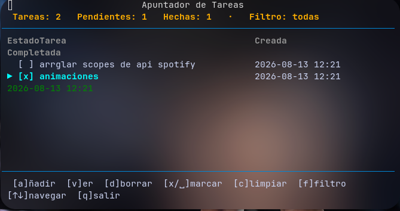

# tasks

Gestor de pendientes **ultraligero** para terminal (TUI), hecho en Python con
[Textual](https://github.com/Textualize/textual). Registro, seguimiento y
resolución de tareas locales con persistencia automática.



## Instalación / uso

### Desde el repo (recomendado)

```bash
git clone https://github.com/jorgeTTPD/tasks
cd tasks
uv tool install -e .        # o: pip install -e .
tasks
```

### Sin instalar (modo desarrollo)

```sh
pip install -r requirements.txt
./run.sh                    # o: python3 apuntador.py
```

## Atajos

| Tecla | Acción |
| ----- | ------ |
| `a` | Añadir tarea (nombre + descripción) |
| `enter` | Confirmar / pasar al siguiente campo |
| `escape` | Cancelar / volver |
| `x`, `w`, `espacio` | Marcar como completada |
| `v` | Ver detalle de la tarea |
| `d` | Eliminar tarea |
| `c` | Limpiar tareas completadas |
| `f` | Ciclar filtro (todas / pendientes / resueltas) |
| `j` / `k` / `↑` / `↓` | Navegar |
| `q` | Salir |

## Cómo funciona

- **Persistencia local** automática en `~/.apuntador_tareas/`.
- Fecha y hora de creación (y de finalización) registradas automáticamente.
- Inicio instantáneo y consumo mínimo de recursos.
